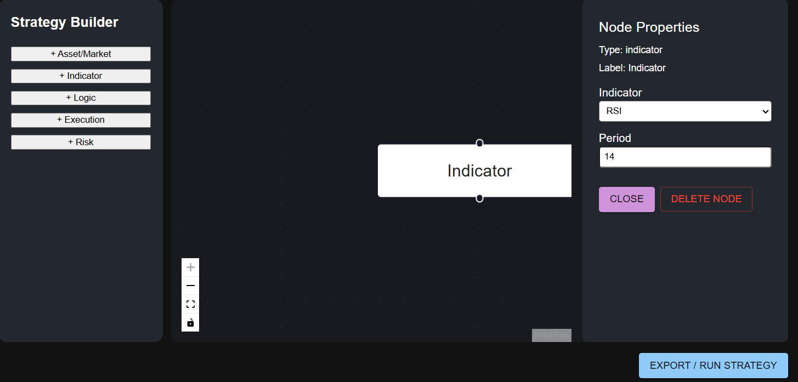
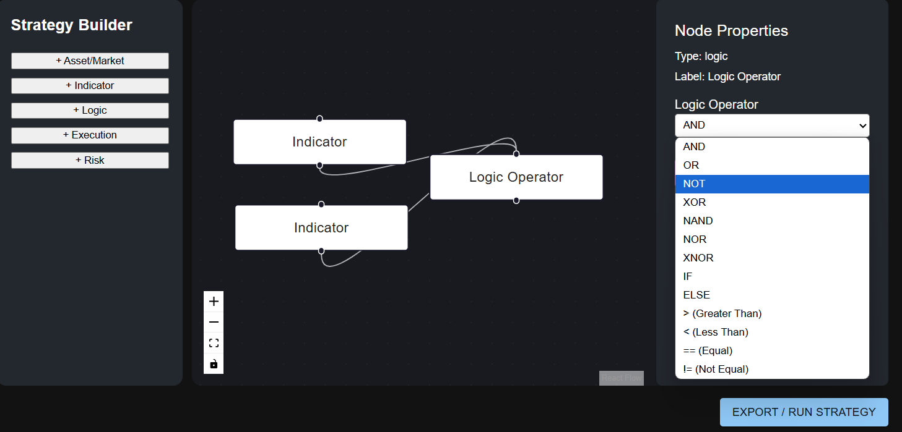
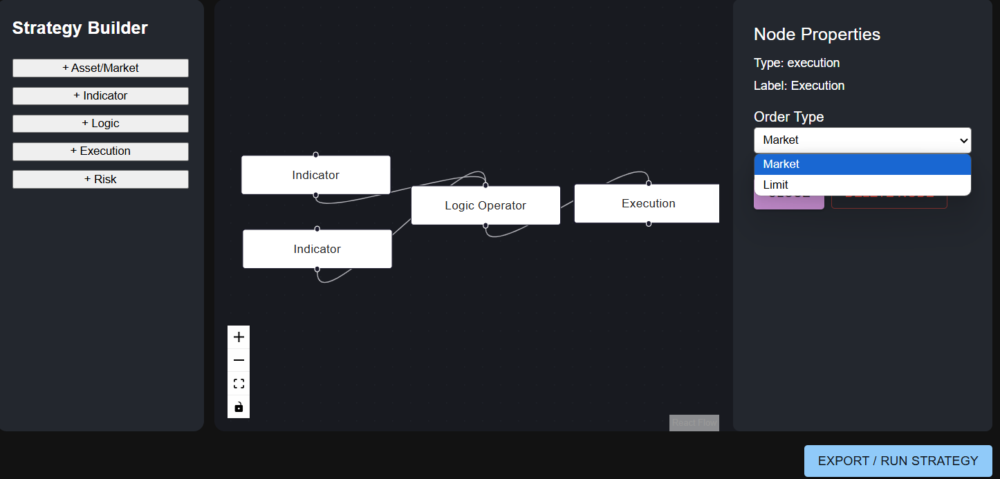
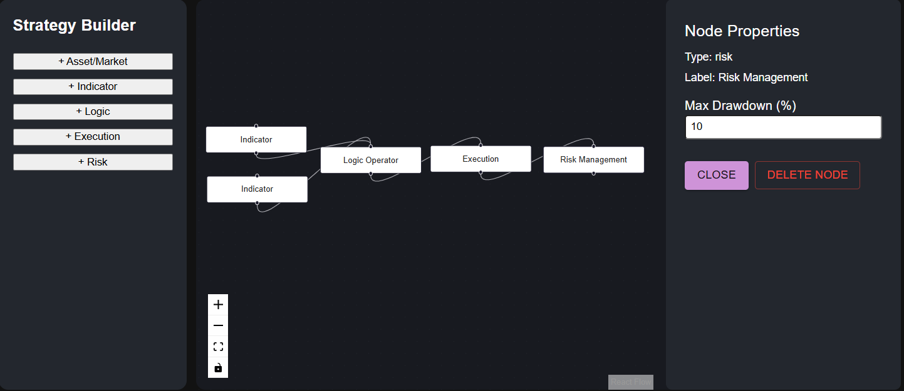

# 🧠 GoQuant Visual Strategy Builder Guide

Welcome to the GoQuant Visual Strategy Builder! This guide will help you create, connect, and run algorithmic trading strategies using the drag-and-drop interface.

---

## 🎛️ Node Types

Each node is a building block of your strategy. Here are the supported node types:

### 📈 Indicator Nodes
Add technical indicators to your strategy:
- **EMA** (Exponential Moving Average): Set the period (e.g., 14, 50).
- **RSI** (Relative Strength Index): Set the period (e.g., 14).
- **MACD** (Moving Average Convergence Divergence): Configure fast/slow/signal periods.

**How to use:**  
Drag an Indicator node onto the canvas, select the indicator type, and set its parameters in the sidebar.

---

### 🔀 Logic Nodes
Define logical relationships and conditions:
- **AND**, **OR**, **NOT**
- **Comparison operators:** `>`, `<`, `==`, `!=` (and soon: `>=`, `<=`)

**How to use:**  
Connect indicator nodes to a Logic node. Choose the logic type (e.g., AND, >) in the sidebar.


---

### ⚙️ Execution Nodes
Specify what happens when your logic conditions are met:
- **Order Type:** Market or Limit

**How to use:**  
Connect a Logic node to an Execution node. Set the order type in the sidebar.


---

### 🛡️ Risk Nodes
Set risk management rules:
- **Max Drawdown** (currently supported)
- (Planned: Stop Loss, Take Profit)


**How to use:**  
Add a Risk node and connect it to Execution or Logic nodes as needed.


---

### 🌐 Asset/Market Nodes
Specify the asset or market:
- **Symbol** (e.g., BTCUSDT)

**How to use:**  
Add an Asset node and enter the symbol in the sidebar.

---

## 🔗 How to Connect Nodes

1. **Drag** nodes from the sidebar to the canvas.
2. **Connect** indicator nodes to logic nodes.
3. **Connect** logic nodes to execution nodes.
4. (Optional) Add and connect risk and asset nodes.

> ⚠️ Your strategy must connect to at least one execution node to be valid.

---

## 🧠 How Your Strategy Is Translated

When you click “Export / Run Strategy”, your node graph is converted into a custom logic string (DSL) and sent to the backend for backtesting.

**Example:**
```
IF EMA_14 > EMA_50 AND RSI_14 < 30 THEN BUY
```
- This means: Buy when the 14-period EMA is above the 50-period EMA and the 14-period RSI is below 30.

---

## 🖱️ Tips

- Click a node to edit its properties in the sidebar.
- Use the “Delete Node” button in the sidebar to remove nodes.
- The result panel below the builder shows your backtest metrics and charts.

---
**Happy strategy building!**  